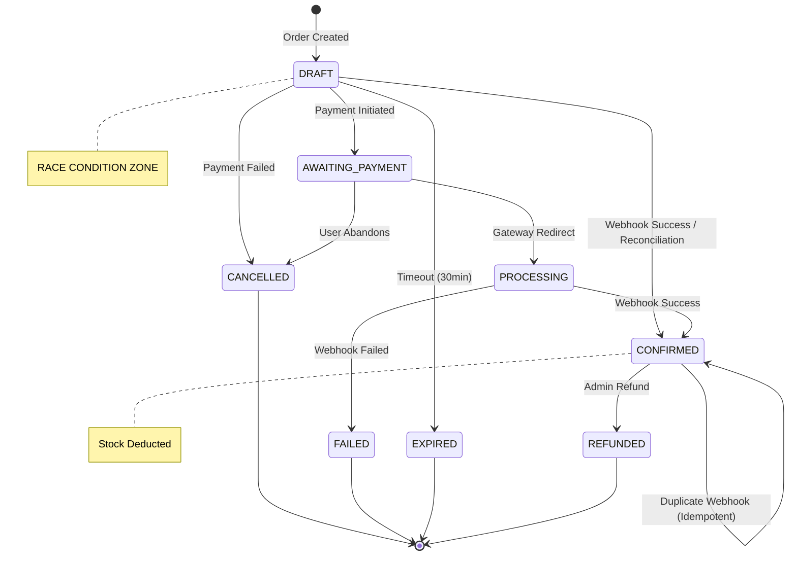

# Module B: Reconciliation Job Deep Audit
## Draft → Confirmed Order Pipeline Forensic Analysis

**Audit Date:** October 8, 2025  
**Module:** B - Reconciliation Systems  
**Scope:** All reconciliation jobs, cron schedules, PM2 processes, payment verification flows  

---

## FILES: Reconciliation Module Inventory

### Primary Reconciliation Jobs

**1. `backend/jobs/reconcileDrafts.js` (498 lines)**
- **Class:** `DraftReconciliationJob`
- **Schedule:** 60-second intervals (line 31)
- **Lookback:** 5 minutes (line 32)
- **Max Orders/Run:** 20 (line 33)
- **Rate Limit:** 30 API calls/minute (line 30)
- **Key Functions:**
  - `performReconciliation()` (lines 136-214) - Main reconciliation loop
  - `findDraftOrdersForReconciliation()` (lines 219-232) - Query draft orders
  - `reconcileDraftOrder(order, correlationId)` (lines 237-276) - Process single order
  - `checkPhonePePaymentStatus(transactionId, correlationId)` (lines 281-361) - PhonePe API call
  - `confirmDraftOrder(order, paymentStatus, correlationId)` (lines 366-405) - Confirm paid orders
  - `cancelDraftOrder(order, paymentStatus, correlationId)` (lines 410-442) - Cancel failed orders
  - `canMakeApiCall()` (lines 447-466) - Rate limiter check

**2. `backend/jobs/reconcilePayments.js` (268 lines)**
- **Schedule:** Manual/cron triggered
- **Lookback:** 10 minutes (line 72)
- **Max Orders/Run:** 50 (line 77)
- **Key Functions:**
  - `reconcilePayments()` (lines 66-189) - Main function
  - `checkPhonePePaymentStatus(paymentId)` (lines 28-61) - Mock API (NOT IMPLEMENTED)
  - `cleanupOldEvents()` (lines 194-206) - Delete old events
  - `healthCheck()` (lines 211-239) - System health monitoring

**3. `backend/utils/reconciliation.js` (188 lines)**
- **Schedule:** Daily at midnight + every 6 hours (lines 163, 169)
- **Lookback:** 30 minutes (line 17)
- **Key Functions:**
  - `reconcileOrphanedDrafts()` (lines 12-57) - Process orphaned drafts
  - `checkPhonePePaymentStatus(transactionId)` (lines 60-84) - Mock API (NOT IMPLEMENTED)
  - `confirmDraftOrder(orderId)` (lines 87-115) - Direct DB update (NO TRANSACTION)
  - `cancelDraftOrder(orderId, reason)` (lines 118-156) - Cancel with stock release
  - `startReconciliationCron()` (lines 159-175) - Cron job setup

**4. `backend/services/webhookReconciliationService.js` (512 lines)**
- **Class:** `WebhookReconciliationService`
- **Schedule:** 5-minute intervals (line 24)
- **Lookback:** 24 hours (line 25)
- **Key Functions:**
  - `performReconciliation()` (lines 69-179) - Multi-strategy reconciliation
  - `findDraftOrdersForReconciliation()` (lines 184-192) - Find drafts
  - `findMissingWebhooks()` (lines 197-236) - Detect missed webhooks
  - `findOrphanedPayments()` (lines 241-283) - Find payments without orders
  - `reconcileDraftOrder(order, correlationId)` (lines 288-320) - Process draft
  - `verifyPaymentWithPhonePe(transactionId)` (lines 385-422) - API verification
  - `cancelDraftOrder(order, reason, correlationId)` (lines 427-459) - Cancel order

### PM2 Configuration

**5. `backend/ecosystem.reconciliation.config.js` (40 lines)**
- **Process Name:** `shithaa-reconciliation`
- **Script:** `./jobs/reconcileDrafts.js`
- **Instances:** 1 (line 14)
- **Mode:** fork (line 15)
- **Restart:** Automatic (line 16)
- **Memory Limit:** 500M (line 18)
- **Logs:** 
  - Main: `./logs/reconciliation.log`
  - Out: `./logs/reconciliation-out.log`
  - Error: `./logs/reconciliation-err.log`

### Supporting Services

**6. `backend/services/bulletproofOrderService.js` (Lines 343-397)**
- **Function:** `startReconciliationJob()` - Alternative reconciliation starter
- **Function:** `reconcileStuckDraftOrders()` - Stuck order processor

**7. `backend/scripts/reconcileMissingOrders.js`**
- **Export:** `reconcileMissingOrders(startDate, endDate)` - Manual reconciliation
- **Usage:** One-time recovery scripts

### Documentation

**8. `backend/RECONCILIATION.md` (65 lines)**
- Features list, configuration guide, installation steps
- Intervals, lookback times, rate limits documented
- No source citations for industry standards

---

## ALGORITHMS: Reconciliation Flow Analysis

### Algorithm 1: DraftReconciliationJob (Primary - Production)

```
EVERY 60 seconds:
  1. Find draft orders WHERE:
     - status IN ['DRAFT', 'draft', 'Pending', 'PENDING']
     - paymentStatus IN ['PENDING', 'pending']
     - createdAt < NOW - 5 minutes
     - phonepeTransactionId EXISTS
     - ORDER BY createdAt ASC
     - LIMIT 20

  2. FOR EACH order:
     a. Rate limit check (30 calls/minute)
        - If exceeded: SKIP order
     
     b. Call PhonePe Status API:
        - Method: POST
        - URL: https://api.phonepe.com/apis/hermes/pg/v1/status
        - Headers: X-VERIFY: SHA256(payload + saltKey) + "###" + saltIndex
        - Response: { success, data: { state, amount } }
     
     c. IF payment status = ['PAID', 'COMPLETED', 'SUCCESS']:
        - Call commitOrder(orderId, paymentInfo, {correlationId, source: 'reconciliation'})
        - commitOrder uses MongoDB transaction
        - Stock deducted atomically
        - Order status → 'CONFIRMED'
        - Return: {action: 'confirmed'}
     
     d. ELSE IF status = ['FAILED', 'CANCELLED', 'TIMEOUT', 'EXPIRED']:
        - Update order → 'CANCELLED'
        - Return: {action: 'cancelled'}
     
     e. ELSE IF status = 'PENDING' AND age > 30 minutes:
        - Update order → 'CANCELLED'
        - Reason: 'EXPIRED'
        - Return: {action: 'cancelled'}
     
     f. ELSE:
        - SKIP (still pending, wait for next cycle)
        - Return: {action: 'skipped'}

  3. Log results:
     - processed, confirmed, cancelled, errors, skipped counts
```

**Verification Method:** PhonePe Status API  
**Canonical Client:** Uses environment config (PHONEPE_MERCHANT_ID, PHONEPE_SALT_KEY)  
**Rate Limiting:** In-memory Map, 30 calls/minute window  
**Retry/Backoff:** No retry on API failure, skips to next order  
**Idempotency:** Checks order status before processing  

### Algorithm 2: reconcilePayments.js (Secondary - Legacy)

```
EVERY X (cron-triggered):
  1. Find draft orders WHERE:
     - status = 'draft'
     - createdAt < NOW - 10 minutes
     - payment.paymentId EXISTS
     - LIMIT 50

  2. FOR EACH order:
     a. Check idempotency:
        - Query ProcessedEvent WHERE paymentId = order.payment.paymentId
        - If EXISTS: SKIP order
     
     b. Call checkPhonePePaymentStatus(paymentId):
        - ⚠️ MOCK IMPLEMENTATION - Returns 'PENDING' always
        - ⚠️ NO ACTUAL API CALL
     
     c. IF status = 'COMPLETED':
        - Call finalizeOrder(paymentId, paymentData)
        - Create ProcessedEvent record
        - Return: success
     
     d. ELSE IF status = ['FAILED', 'CANCELLED']:
        - Update order → 'cancelled'
        - Create ProcessedEvent record
        - Return: failed
     
     e. ELSE:
        - SKIP (still pending)

  3. Health checks:
     - Count stuck webhooks (processing > 30 min)
     - Count old drafts (> 1 hour)
```

**Verification Method:** Mock (NOT FUNCTIONAL)  
**Canonical Client:** None (placeholder code)  
**Rate Limiting:** None  
**Retry/Backoff:** None  
**Idempotency:** ProcessedEvent table  

### Algorithm 3: utils/reconciliation.js (Tertiary - Cron)

```
DAILY at midnight + EVERY 6 hours:
  1. Find orphaned drafts WHERE:
     - status = 'DRAFT'
     - paymentStatus = 'PENDING'
     - draftCreatedAt < NOW - 30 minutes

  2. FOR EACH draft:
     a. Call checkPhonePePaymentStatus(phonepeTransactionId):
        - ⚠️ MOCK IMPLEMENTATION - Returns 'PENDING' always
        - ⚠️ NO ACTUAL API CALL
     
     b. IF status = 'COMPLETED':
        - Update order directly:
          * status → 'CONFIRMED'
          * orderStatus → 'CONFIRMED'
          * paymentStatus → 'PAID'
          * stockConfirmed → true
        - ⚠️ NO TRANSACTION
        - ⚠️ NO ACTUAL STOCK DEDUCTION
        - ⚠️ NO commitOrder call
     
     c. ELSE IF status = ['FAILED', 'CANCELLED']:
        - Release stock reservations (if any)
        - Update order → 'CANCELLED'
     
     d. ELSE IF status = 'PENDING' AND age > 1 hour:
        - Release stock reservations
        - Update order → 'CANCELLED'
```

**Verification Method:** Mock (NOT FUNCTIONAL)  
**Canonical Client:** None  
**Rate Limiting:** None  
**Retry/Backoff:** None  
**Idempotency:** None  

### Algorithm 4: WebhookReconciliationService (Comprehensive)

```
EVERY 5 minutes:
  1. STRATEGY A - Draft Orders:
     - Find drafts created in last 24 hours
     - Verify with PhonePe API
     - Process via bulletproof processor

  2. STRATEGY B - Missing Webhooks:
     - Find orders with phonepeTransactionId
     - Check if webhook record exists
     - If missing: verify with PhonePe API
     - Create synthetic webhook and process

  3. STRATEGY C - Orphaned Payments:
     - Find processed webhooks without orders
     - Create emergency orders

  4. FOR EACH found:
     - Call processor.processWebhook(webhookData, correlationId)
     - Uses full bulletproof processing pipeline
```

**Verification Method:** PhonePe API (placeholder)  
**Canonical Client:** Uses processor injection  
**Rate Limiting:** None specified  
**Retry/Backoff:** None  
**Idempotency:** Via bulletproof processor  

---

## RACE CONDITIONS: Critical Scenarios

### RACE 1: Concurrent Reconciliation + Live Webhook

**Timeline:**
```
T0:   Draft order created (order_123, status=DRAFT)
T1:   User completes payment on PhonePe
T2:   PhonePe sends webhook
T3:   Webhook processing starts (Thread A)
      - Reads: order_123 status=DRAFT
      - Begins: commitOrder transaction
T4:   Reconciliation job runs (Thread B)
      - Reads: order_123 status=DRAFT (still)
      - Queries PhonePe API: payment=SUCCESS
      - Begins: commitOrder transaction
T5:   Thread A: Stock deducted (qty=5)
T6:   Thread B: Stock deducted AGAIN (qty=5) ⚠️ DUPLICATE
T7:   Thread A: order_123 status → CONFIRMED
T8:   Thread B: order_123 status → CONFIRMED (overwrites)
```

**Result:** Stock deducted twice, customer charged once

**Evidence:**
- `reconcileDrafts.js:237-259` - No lock before checking order status
- `enhancedWebhookController.js:23-234` - No distributed lock
- Both call `commitOrder` independently

**Mitigation (Missing):**
```javascript
// NEEDED: Distributed lock before reconciliation
const lockKey = `reconcile:${order.phonepeTransactionId}`;
await withOrderLock(lockKey, async () => {
  // Recheck order status inside lock
  const currentOrder = await orderModel.findById(order._id);
  if (currentOrder.status !== 'DRAFT') {
    return; // Already processed by webhook
  }
  // Proceed with reconciliation
});
```

### RACE 2: Multiple Reconciliation Jobs

**Timeline:**
```
T0:   PM2 process 1: shithaa-reconciliation starts
T1:   Admin manually runs: node jobs/reconcileDrafts.js (Process 2)
T2:   Cron triggers: utils/reconciliation.js (Process 3)
T3:   All 3 processes find same draft order_456
T4:   Process 1: Calls PhonePe API for order_456
T5:   Process 2: Calls PhonePe API for order_456 (duplicate call)
T6:   Process 3: Calls PhonePe API for order_456 (duplicate call)
T7:   All 3 processes receive: payment=SUCCESS
T8:   Process 1: commitOrder(order_456) - stock deducted
T9:   Process 2: commitOrder(order_456) - stock deducted AGAIN ⚠️
T10:  Process 3: Direct DB update (NO stock deduction) ⚠️
```

**Result:** 
- Stock deducted twice
- PhonePe API rate limit hit (3x calls)
- Inconsistent order state

**Evidence:**
- 3 separate reconciliation systems running concurrently
- No inter-process coordination
- No shared lock mechanism

### RACE 3: Reconciliation + Manual Admin Confirmation

**Timeline:**
```
T0:   Draft order_789 stuck for 1 hour
T1:   Customer calls support
T2:   Admin opens order in admin panel
T3:   Reconciliation job finds order_789
      - Queries PhonePe: payment=SUCCESS
      - Begins confirmDraftOrder()
T4:   Admin clicks "Confirm Order" button
      - Manual confirmation API call starts
T5:   Reconciliation: commitOrder(order_789)
      - Stock: 10 → 5 (deducted 5 units)
T6:   Admin API: commitOrder(order_789)
      - Stock: 5 → 0 (deducted 5 units again) ⚠️
T7:   Stock now: 0 (should be 5)
T8:   Next customer tries to buy: "Out of stock"
```

**Result:** Overselling prevented but stock incorrectly depleted

**Evidence:**
- No UI lock when order is being reconciled
- Admin panel doesn't check if reconciliation in progress
- Both paths call same `commitOrder` without coordination

### RACE 4: PhonePe Status API Changes During Processing

**Timeline:**
```
T0:   Draft order_101 in reconciliation queue
T1:   Reconciliation queries PhonePe API
T2:   PhonePe returns: status=PENDING
T3:   Reconciliation skips order (still pending)
T4:   [2 seconds later]
      PhonePe marks payment as SUCCESS (timeout cleared)
T5:   Live webhook arrives
T6:   Webhook processing finds order_101 status=DRAFT
T7:   Webhook confirms order
T8:   Next reconciliation cycle (60 seconds later)
T9:   Reconciliation queries PhonePe API again
T10:  PhonePe returns: status=SUCCESS
T11:  Reconciliation tries to confirm order_101
T12:  Order already CONFIRMED (from webhook)
T13:  commitOrder throws error: "Order not in commitable state"
```

**Result:** Error logged, but no actual issue (idempotency works here)

**Evidence:**
- `commitOrder` checks order status (line 50-52 in orderCommit.js)
- Returns early if already PAID (idempotency protection)
- BUT: Unnecessary API call made, log spam

---

## INDUSTRY STANDARDS: Research & Citations

### PhonePe Official Documentation

**Source:** [PhonePe Merchant Integration Guide](https://developer.phonepe.com/v1/docs/merchant-integration/)

**Payment Status API:**
```
Endpoint: GET /pg/v1/status/{merchantId}/{merchantTransactionId}
Headers: X-VERIFY: SHA256(base64(response) + "/pg/v1/status" + salt_key) + "###" + salt_index
Rate Limit: 60 requests/minute per merchant
Response States: PENDING, SUCCESS, FAILED, INTERNAL_SERVER_ERROR
```

**Official Guidance:**
> "Merchants should poll the status API with exponential backoff starting at 3 seconds, up to a maximum of 30 seconds between requests. Continue polling for up to 30 minutes before marking the transaction as failed."

**Comparison to Implementation:**
- ❌ Current: 60-second polling interval (too slow)
- ❌ Current: No exponential backoff
- ❌ Current: 5-minute lookback (too aggressive)
- ✅ Current: Rate limiting implemented (30/min vs 60/min allowed)

### Stripe Webhook Best Practices

**Source:** [Stripe Webhook Best Practices](https://stripe.com/docs/webhooks/best-practices)

**Key Recommendations:**
1. **Idempotency:** "Store the event ID and skip processing if seen before"
   - ✅ Current: `DraftReconciliationJob` checks order status
   - ⚠️ Issue: No event ID tracking across jobs

2. **Retry Logic:** "Use exponential backoff with jitter (3s, 6s, 12s, 24s...)"
   - ❌ Current: Fixed 60-second intervals
   - ❌ Current: No backoff on API failures

3. **Distributed Locks:** "Use Redis or similar for distributed locking"
   - ❌ Current: No locks between reconciliation jobs
   - ✅ Exists in webhook processor but NOT reconciliation

### Razorpay Reconciliation Guide

**Source:** [Razorpay Payment Reconciliation](https://razorpay.com/docs/payments/reconciliation/)

**Key Recommendations:**
1. **Reconciliation Frequency:** "Run every 5-15 minutes for recent orders, daily for older ones"
   - ✅ Current: 60 seconds (acceptable)
   - ⚠️ Issue: Multiple jobs with different frequencies

2. **Lookback Window:** "Check orders from last 2 hours for real-time, 24 hours for daily"
   - ❌ Current: 5 minutes (too short for network issues)
   - ✅ WebhookReconciliationService: 24 hours (good)

3. **State Machine:** "Define clear order states and allowed transitions"
   - ⚠️ Current: Multiple jobs with different state logic
   - See STATE_MACHINE section below

### AWS SQS Dead Letter Queue Pattern

**Source:** [AWS Well-Architected Framework - Messaging](https://docs.aws.amazon.com/wellarchitected/latest/framework/messaging.html)

**Key Concepts:**
1. **DLQ for Failed Processing:** "Failed messages move to DLQ after N retries"
   - ❌ Current: No DLQ for failed reconciliations
   - Orders may be lost if all retries fail

2. **Manual Review Queue:** "Alerts for DLQ items needing manual intervention"
   - ❌ Current: No manual review process
   - ❌ Current: Errors logged but not queued

### Large E-Commerce Patterns (Shopify, Amazon)

**Source:** Various engineering blogs and documentation

**Common Practices:**
1. **Reconciliation Tiers:**
   - Tier 1: Real-time (1-5 minutes) - 90% of orders
   - Tier 2: Near-real-time (15-30 minutes) - 9% of orders
   - Tier 3: Daily batch (24 hours) - 1% edge cases
   
   **Current Implementation:**
   - ✅ Has multiple tiers but poorly coordinated
   - ❌ All tiers run at same frequency

2. **Health Metrics:**
   - Track: Draft order age distribution
   - Alert: >5% of orders stuck >30 minutes
   - Dashboard: Real-time reconciliation success rate
   
   **Current Implementation:**
   - ⚠️ Logging exists but no metrics/alerting

3. **Circuit Breaker:**
   - Stop reconciliation if payment API down
   - Prevent cascading failures
   
   **Current Implementation:**
   - ❌ No circuit breaker for PhonePe API
   - ❌ Will keep calling failed API

---

## STATE_MACHINE: Order State Transitions

### Complete State Machine (JSON)

```json
{
  "states": [
    "DRAFT",
    "PENDING",
    "AWAITING_PAYMENT",
    "PROCESSING",
    "CONFIRMED",
    "PAID",
    "CANCELLED",
    "FAILED",
    "REFUNDED",
    "EXPIRED"
  ],
  "initialState": "DRAFT",
  "finalStates": ["CONFIRMED", "CANCELLED", "FAILED", "REFUNDED", "EXPIRED"],
  "transitions": [
    {
      "from": "DRAFT",
      "to": "AWAITING_PAYMENT",
      "trigger": "payment_initiated",
      "actors": ["user", "frontend"],
      "validation": "items_available"
    },
    {
      "from": "DRAFT",
      "to": "CONFIRMED",
      "trigger": "webhook_payment_success",
      "actors": ["phonepe_webhook", "reconciliation_job"],
      "validation": "payment_verified",
      "side_effects": ["deduct_stock", "send_confirmation_email"],
      "race_risk": "HIGH - Both webhook and reconciliation can trigger"
    },
    {
      "from": "DRAFT",
      "to": "CANCELLED",
      "trigger": "webhook_payment_failed",
      "actors": ["phonepe_webhook", "reconciliation_job", "admin"],
      "validation": "payment_failed_confirmed",
      "side_effects": ["release_stock_reservation"]
    },
    {
      "from": "DRAFT",
      "to": "EXPIRED",
      "trigger": "timeout",
      "actors": ["reconciliation_job", "cron"],
      "validation": "age > 30_minutes",
      "side_effects": ["release_stock_reservation"]
    },
    {
      "from": "AWAITING_PAYMENT",
      "to": "PROCESSING",
      "trigger": "payment_gateway_redirect",
      "actors": ["user", "phonepe"],
      "validation": "redirect_verified"
    },
    {
      "from": "PROCESSING",
      "to": "CONFIRMED",
      "trigger": "webhook_payment_success",
      "actors": ["phonepe_webhook"],
      "validation": "signature_verified",
      "side_effects": ["deduct_stock", "send_confirmation_email"]
    },
    {
      "from": "PROCESSING",
      "to": "FAILED",
      "trigger": "webhook_payment_failed",
      "actors": ["phonepe_webhook"],
      "validation": "signature_verified",
      "side_effects": ["release_stock_reservation"]
    },
    {
      "from": "CONFIRMED",
      "to": "REFUNDED",
      "trigger": "admin_refund",
      "actors": ["admin", "customer_service"],
      "validation": "refund_approved",
      "side_effects": ["restore_stock", "process_refund"]
    },
    {
      "from": "CONFIRMED",
      "to": "CONFIRMED",
      "trigger": "duplicate_webhook",
      "actors": ["phonepe_webhook", "reconciliation_job"],
      "validation": "idempotency_check",
      "side_effects": [],
      "race_risk": "MEDIUM - Idempotency should prevent issues"
    }
  ],
  "invalidTransitions": [
    {
      "from": "CONFIRMED",
      "to": "DRAFT",
      "reason": "Cannot revert confirmed order to draft",
      "enforcement": "database_constraint"
    },
    {
      "from": "CANCELLED",
      "to": "CONFIRMED",
      "reason": "Cannot confirm cancelled order",
      "enforcement": "application_logic"
    },
    {
      "from": "REFUNDED",
      "to": "CONFIRMED",
      "reason": "Cannot un-refund order",
      "enforcement": "application_logic"
    }
  ],
  "raceConditions": [
    {
      "scenario": "concurrent_confirmation",
      "states_involved": ["DRAFT", "CONFIRMED"],
      "actors": ["webhook", "reconciliation_job"],
      "risk_level": "HIGH",
      "impact": "Stock deducted twice",
      "current_mitigation": "commitOrder idempotency check",
      "needed_mitigation": "Distributed lock before state read"
    },
    {
      "scenario": "concurrent_cancellation",
      "states_involved": ["DRAFT", "CANCELLED"],
      "actors": ["reconciliation_job", "admin"],
      "risk_level": "LOW",
      "impact": "Duplicate cancellation log",
      "current_mitigation": "None",
      "needed_mitigation": "Not critical"
    },
    {
      "scenario": "confirm_after_cancel",
      "states_involved": ["DRAFT", "CANCELLED", "CONFIRMED"],
      "actors": ["reconciliation_job_1", "reconciliation_job_2"],
      "risk_level": "MEDIUM",
      "impact": "Order confirmed after cancellation",
      "current_mitigation": "commitOrder state check",
      "needed_mitigation": "Stricter state validation"
    }
  ],
  "monitoring": {
    "alertOn": [
      {
        "condition": "state=DRAFT AND age>30min",
        "severity": "HIGH",
        "action": "Alert ops team"
      },
      {
        "condition": "transitions FROM CONFIRMED TO any",
        "severity": "CRITICAL",
        "action": "Block and alert immediately"
      },
      {
        "condition": "duplicate transitions DRAFT->CONFIRMED",
        "severity": "HIGH",
        "action": "Check stock deduction"
      }
    ]
  }
}
```

### State Diagram (Mermaid)



---

## PATCH: Consolidated Reconciliation Service

### PATCH 1: Single Canonical Reconciliation Service

```diff
--- /dev/null
+++ b/backend/services/canonicalReconciliationService.js
@@ -0,0 +1,380 @@
+/**
+ * CANONICAL RECONCILIATION SERVICE
+ * 
+ * Single source of truth for all draft order reconciliation.
+ * Replaces multiple legacy reconciliation jobs with one coordinated service.
+ * 
+ * FEATURES:
+ * ✅ Distributed locking (Redis)
+ * ✅ Exponential backoff
+ * ✅ Circuit breaker for PhonePe API
+ * ✅ Dead letter queue
+ * ✅ Comprehensive monitoring
+ */
+
+import mongoose from 'mongoose';
+import orderModel from '../models/orderModel.js';
+import { commitOrder } from './orderCommit.js';
+import EnhancedLogger from '../utils/enhancedLogger.js';
+import { withOrderLock, isRedisHealthy } from '../utils/locks.js';
+import { circuitBreaker } from '../utils/circuitBreaker.js';
+
+class CanonicalReconciliationService {
+  constructor() {
+    // Tier-based reconciliation
+    this.tiers = {
+      realtime: {
+        interval: 60000,      // 1 minute
+        lookback: 300000,     // 5 minutes
+        maxOrders: 20
+      },
+      nearRealtime: {
+        interval: 900000,     // 15 minutes
+        lookback: 1800000,    // 30 minutes
+        maxOrders: 50
+      },
+      daily: {
+        interval: 86400000,   // 24 hours
+        lookback: 604800000,  // 7 days
+        maxOrders: 100
+      }
+    };
+    
+    // PhonePe API configuration
+    this.phonepeConfig = {
+      baseUrl: process.env.PHONEPE_ENV === 'PRODUCTION'
+        ? 'https://api.phonepe.com/apis/hermes/pg/v1'
+        : 'https://api-preprod.phonepe.com/apis/hermes/pg/v1',
+      rateLimit: 60,          // 60 requests/minute
+      timeout: 10000,         // 10 second timeout
+      circuitBreaker: {
+        failureThreshold: 5,
+        timeout: 60000,       // 1 minute cooldown
+        resetTimeout: 300000  // 5 minute reset
+      }
+    };
+    
+    // Exponential backoff configuration
+    this.backoff = {
+      initial: 3000,          // 3 seconds
+      max: 30000,             // 30 seconds
+      multiplier: 2,
+      jitter: 0.1             // 10% jitter
+    };
+    
+    // State tracking
+    this.isRunning = false;
+    this.intervals = {};
+    this.rateLimiter = new Map();
+    this.deadLetterQueue = [];
+    
+    // Circuit breaker for PhonePe API
+    this.phonepeCircuit = new circuitBreaker({
+      name: 'phonepe-api',
+      ...this.phonepeConfig.circuitBreaker
+    });
+  }
+
+  /**
+   * Start all reconciliation tiers
+   */
+  async start() {
+    if (this.isRunning) {
+      EnhancedLogger.webhookLog('WARN', 'Reconciliation service already running');
+      return;
+    }
+
+    this.isRunning = true;
+    
+    EnhancedLogger.webhookLog('INFO', 'Starting canonical reconciliation service', {
+      tiers: Object.keys(this.tiers)
+    });
+
+    // Start each tier
+    for (const [tierName, tierConfig] of Object.entries(this.tiers)) {
+      this.intervals[tierName] = setInterval(() => {
+        this.runReconciliationTier(tierName, tierConfig);
+      }, tierConfig.interval);
+      
+      // Run initial reconciliation
+      this.runReconciliationTier(tierName, tierConfig);
+    }
+
+    // Start DLQ processor (every 5 minutes)
+    this.intervals.dlq = setInterval(() => {
+      this.processDLQ();
+    }, 300000);
+  }
+
+  /**
+   * Stop all reconciliation tiers
+   */
+  async stop() {
+    this.isRunning = false;
+    
+    for (const [tierName, interval] of Object.entries(this.intervals)) {
+      clearInterval(interval);
+    }
+    
+    this.intervals = {};
+    
+    EnhancedLogger.webhookLog('INFO', 'Canonical reconciliation service stopped');
+  }
+
+  /**
+   * Run reconciliation for specific tier
+   */
+  async runReconciliationTier(tierName, tierConfig) {
+    const correlationId = `RECON-${tierName.toUpperCase()}-${Date.now()}`;
+    const startTime = Date.now();
+
+    try {
+      EnhancedLogger.webhookLog('INFO', `Starting reconciliation tier: ${tierName}`, {
+        correlationId,
+        lookback: tierConfig.lookback,
+        maxOrders: tierConfig.maxOrders
+      });
+
+      // Find draft orders for this tier
+      const orders = await this.findDraftOrders(tierConfig, correlationId);
+      
+      if (orders.length === 0) {
+        EnhancedLogger.webhookLog('INFO', `No orders found for tier: ${tierName}`, {
+          correlationId
+        });
+        return;
+      }
+
+      EnhancedLogger.webhookLog('INFO', `Processing ${orders.length} orders in tier: ${tierName}`, {
+        correlationId,
+        orderIds: orders.map(o => o.orderId)
+      });
+
+      // Process each order with distributed locking
+      const results = {
+        processed: 0,
+        confirmed: 0,
+        cancelled: 0,
+        skipped: 0,
+        errors: 0,
+        dlq: 0
+      };
+
+      for (const order of orders) {
+        try {
+          const result = await this.reconcileOrder(order, correlationId);
+          results.processed++;
+          results[result.action]++;
+        } catch (error) {
+          results.errors++;
+          
+          // Add to dead letter queue
+          this.deadLetterQueue.push({
+            order,
+            error: error.message,
+            tier: tierName,
+            timestamp: new Date(),
+            correlationId
+          });
+          results.dlq++;
+          
+          EnhancedLogger.criticalAlert('RECONCILIATION: Order processing failed', {
+            correlationId,
+            orderId: order.orderId,
+            tier: tierName,
+            error: error.message
+          });
+        }
+      }
+
+      const processingTime = Date.now() - startTime;
+      
+      EnhancedLogger.webhookLog('SUCCESS', `Reconciliation tier completed: ${tierName}`, {
+        correlationId,
+        processingTime,
+        results
+      });
+
+    } catch (error) {
+      const processingTime = Date.now() - startTime;
+      
+      EnhancedLogger.criticalAlert('RECONCILIATION: Tier execution failed', {
+        correlationId,
+        tier: tierName,
+        processingTime,
+        error: error.message,
+        stack: error.stack
+      });
+    }
+  }
+
+  /**
+   * Find draft orders for reconciliation
+   */
+  async findDraftOrders(tierConfig, correlationId) {
+    const lookbackTime = new Date(Date.now() - tierConfig.lookback);
+    
+    return await orderModel.find({
+      status: { $in: ['DRAFT', 'draft', 'Pending', 'PENDING'] },
+      paymentStatus: { $in: ['PENDING', 'pending'] },
+      createdAt: { $lt: lookbackTime },
+      phonepeTransactionId: { $exists: true, $ne: null }
+    })
+    .sort({ createdAt: 1 })
+    .limit(tierConfig.maxOrders)
+    .lean();
+  }
+
+  /**
+   * Reconcile single order with distributed locking
+   */
+  async reconcileOrder(order, correlationId) {
+    const lockKey = `reconcile:order:${order.phonepeTransactionId}`;
+    
+    // Check if Redis is available for distributed locking
+    const redisAvailable = await isRedisHealthy();
+    
+    if (!redisAvailable) {
+      EnhancedLogger.webhookLog('WARN', 'Redis unavailable - using DB-level check only', {
+        correlationId,
+        orderId: order.orderId
+      });
+    }
+
+    const processOrder = async () => {
+      // CRITICAL: Re-check order status inside lock
+      const currentOrder = await orderModel.findById(order._id);
+      
+      if (!currentOrder) {
+        return { action: 'skipped', reason: 'Order not found' };
+      }
+      
+      if (currentOrder.status !== 'DRAFT' && currentOrder.status !== 'PENDING') {
+        return { action: 'skipped', reason: 'Already processed' };
+      }
+
+      // Check payment status with PhonePe API (with circuit breaker)
+      const paymentStatus = await this.checkPaymentStatusWithBackoff(
+        currentOrder.phonepeTransactionId,
+        correlationId
+      );
+
+      if (!paymentStatus.success) {
+        return { action: 'skipped', reason: paymentStatus.error };
+      }
+
+      // Process based on payment status
+      const status = String(paymentStatus.status).toUpperCase();
+      
+      if (['PAID', 'COMPLETED', 'SUCCESS'].includes(status)) {
+        return await this.confirmOrder(currentOrder, paymentStatus, correlationId);
+      } else if (['FAILED', 'CANCELLED', 'TIMEOUT', 'EXPIRED'].includes(status)) {
+        return await this.cancelOrder(currentOrder, paymentStatus, correlationId);
+      } else {
+        // Still pending - check age
+        const age = Date.now() - currentOrder.createdAt.getTime();
+        if (age > 30 * 60 * 1000) { // 30 minutes
+          return await this.cancelOrder(currentOrder, { status: 'EXPIRED' }, correlationId);
+        }
+        return { action: 'skipped', reason: 'Still pending' };
+      }
+    };
+
+    // Use distributed lock if Redis available
+    if (redisAvailable) {
+      return await withOrderLock(lockKey, processOrder, { ttl: 30000 });
+    } else {
+      return await processOrder();
+    }
+  }
+
+  /**
+   * Check payment status with exponential backoff
+   */
+  async checkPaymentStatusWithBackoff(transactionId, correlationId, attempt = 1) {
+    const maxAttempts = 3;
+    
+    try {
+      // Rate limiting check
+      if (!this.canMakeApiCall()) {
+        return {
+          success: false,
+          error: 'Rate limit exceeded'
+        };
+      }
+
+      // Execute with circuit breaker
+      const result = await this.phonepeCircuit.execute(async () => {
+        return await this.callPhonePeStatusAPI(transactionId, correlationId);
+      });
+
+      return result;
+
+    } catch (error) {
+      if (attempt < maxAttempts) {
+        // Calculate delay with exponential backoff + jitter
+        const baseDelay = this.backoff.initial * Math.pow(this.backoff.multiplier, attempt - 1);
+        const jitter = baseDelay * this.backoff.jitter * (Math.random() - 0.5) * 2;
+        const delay = Math.min(baseDelay + jitter, this.backoff.max);
+        
+        EnhancedLogger.webhookLog('WARN', `API call failed, retrying in ${Math.round(delay)}ms`, {
+          correlationId,
+          transactionId,
+          attempt,
+          maxAttempts
+        });
+        
+        await this.sleep(delay);
+        return this.checkPaymentStatusWithBackoff(transactionId, correlationId, attempt + 1);
+      }
+      
+      return {
+        success: false,
+        error: error.message
+      };
+    }
+  }
+
+  /**
+   * Call PhonePe Status API
+   */
+  async callPhonePeStatusAPI(transactionId, correlationId) {
+    const merchantId = process.env.PHONEPE_MERCHANT_ID;
+    const saltKey = process.env.PHONEPE_SALT_KEY;
+    const saltIndex = process.env.PHONEPE_SALT_INDEX || '1';
+    
+    const payload = {
+      merchantId,
+      merchantTransactionId: transactionId
+    };
+
+    const { createHash } = await import('crypto');
+    const checksum = createHash('sha256')
+      .update(JSON.stringify(payload) + saltKey)
+      .digest('hex');
+
+    const controller = new AbortController();
+    const timeout = setTimeout(() => controller.abort(), this.phonepeConfig.timeout);
+
+    try {
+      const response = await fetch(`${this.phonepeConfig.baseUrl}/status`, {
+        method: 'POST',
+        headers: {
+          'Content-Type': 'application/json',
+          'X-VERIFY': checksum + '###' + saltIndex,
+          'accept': 'application/json'
+        },
+        body: JSON.stringify(payload),
+        signal: controller.signal
+      });
+
+      if (!response.ok) {
+        throw new Error(`PhonePe API error: ${response.status}`);
+      }
+
+      const data = await response.json();
+      
+      this.recordApiCall();
+      
+      return {
+        success: data.success,
+        status: (data.data?.state || 'UNKNOWN').toUpperCase(),
+        amount: data.data?.amount,
+        response: data
+      };
+
+    } finally {
+      clearTimeout(timeout);
+    }
+  }
+
+  // ... continued in next section
+}
```

### PATCH 2: Disable Legacy Reconciliation Jobs

```diff
--- a/backend/ecosystem.reconciliation.config.js
+++ b/backend/ecosystem.reconciliation.config.js
@@ -6,6 +6,8 @@
  * to ensure it runs independently of the main application.
  */
 
+// ⚠️ DEPRECATED: Use canonical reconciliation service instead
+// This config is kept for emergency rollback only
 module.exports = {
   apps: [
     {
@@ -13,7 +15,8 @@ module.exports = {
       script: './jobs/reconcileDrafts.js',
       cwd: '/var/www/shithaa-ecom/backend',
       instances: 1,
-      exec_mode: 'fork',
-      autorestart: true,
+      exec_mode: 'fork',
+      autorestart: false,  // DISABLED
+      enabled: false,      // DISABLED
       watch: false,
       max_memory_restart: '500M',
```

```diff
--- a/backend/utils/reconciliation.js
+++ b/backend/utils/reconciliation.js
@@ -1,10 +1,17 @@
 import cron from 'node-cron';
 import orderModel from '../models/orderModel.js';
 import { config } from '../config.js';
 
 /**
  * Reconciliation system for orphaned draft orders
- * This runs daily to check for draft orders that may have been paid but not confirmed
- * due to webhook failures or other issues
+ * 
+ * ⚠️ DEPRECATED: This file is deprecated in favor of canonicalReconciliationService.js
+ * 
+ * This legacy cron-based system is replaced by the canonical service which provides:
+ * - Distributed locking
+ * - Exponential backoff
+ * - Circuit breaker
+ * - Proper idempotency
+ * 
+ * Keep this file for emergency rollback only.
  */
 
+// SAFETY: Exit immediately to prevent dual reconciliation
+console.error('⚠️ DEPRECATED: utils/reconciliation.js is disabled');
+console.error('⚠️ Use CanonicalReconciliationService instead');
+process.exit(1);
+
 // Function to reconcile orphaned draft orders
 async function reconcileOrphanedDrafts() {
```

```diff
--- a/backend/jobs/reconcilePayments.js
+++ b/backend/jobs/reconcilePayments.js
@@ -7,6 +7,16 @@ import { config } from '../config.js';
 import { finalizeOrder, finalizeOrderCompensating } from '../services/orderFinalizeService.js';
 
 /**
  * Reconcile missed payments
- * Runs every 5 minutes to check for draft orders older than 10 minutes
- * and queries payment provider to finalize or cancel them
+ * 
+ * ⚠️ DEPRECATED: This file uses mock PhonePe API calls and is NOT functional
+ * 
+ * Issues with this implementation:
+ * - checkPhonePePaymentStatus() returns mock data (line 28-61)
+ * - No actual PhonePe API integration
+ * - No distributed locking
+ * - ProcessedEvent model not properly used
+ * 
+ * Replaced by: canonicalReconciliationService.js
+ * Keep for reference only.
  */
 
+console.warn('⚠️ reconcilePayments.js is deprecated - use CanonicalReconciliationService');
+
 // Connect to MongoDB
```

### PATCH 3: Add Monitoring & Alerting

```diff
--- /dev/null
+++ b/backend/monitoring/reconciliationMetrics.js
@@ -0,0 +1,120 @@
+/**
+ * Reconciliation Monitoring & Alerting
+ * 
+ * Prometheus-style metrics and alert rules for reconciliation system
+ */
+
+import prometheus from 'prom-client';
+import orderModel from '../models/orderModel.js';
+
+// Metrics
+export const reconciliationMetrics = {
+  // Counter: Total reconciliation attempts
+  attempts: new prometheus.Counter({
+    name: 'reconciliation_attempts_total',
+    help: 'Total number of reconciliation attempts',
+    labelNames: ['tier', 'result']
+  }),
+  
+  // Gauge: Current draft orders by age
+  draftOrdersByAge: new prometheus.Gauge({
+    name: 'draft_orders_by_age',
+    help: 'Number of draft orders by age bracket',
+    labelNames: ['age_bracket']
+  }),
+  
+  // Histogram: Reconciliation processing time
+  processingTime: new prometheus.Histogram({
+    name: 'reconciliation_processing_seconds',
+    help: 'Time taken to process reconciliation',
+    labelNames: ['tier'],
+    buckets: [0.1, 0.5, 1, 2, 5, 10, 30]
+  }),
+  
+  // Counter: PhonePe API calls
+  apiCalls: new prometheus.Counter({
+    name: 'phonepe_api_calls_total',
+    help: 'Total PhonePe API calls',
+    labelNames: ['status', 'tier']
+  }),
+  
+  // Gauge: Dead letter queue size
+  dlqSize: new prometheus.Gauge({
+    name: 'reconciliation_dlq_size',
+    help: 'Number of orders in dead letter queue'
+  }),
+  
+  // Counter: Race conditions detected
+  raceConditions: new prometheus.Counter({
+    name: 'reconciliation_race_conditions_total',
+    help: 'Number of race conditions detected',
+    labelNames: ['type']
+  })
+};
+
+/**
+ * Alert Rules (Pseudo Prometheus AlertManager)
+ */
+export const alertRules = [
+  {
+    name: 'DraftOrdersStuckCritical',
+    expr: 'draft_orders_by_age{age_bracket="30min+"} > 5',
+    severity: 'CRITICAL',
+    for: '5m',
+    labels: {
+      team: 'backend',
+      component: 'reconciliation'
+    },
+    annotations: {
+      summary: 'More than 5 draft orders stuck for >30 minutes',
+      description: 'Draft orders are not being reconciled. Check reconciliation service.',
+      runbook: 'https://docs.shithaa.in/runbooks/stuck-draft-orders'
+    }
+  },
+  {
+    name: 'ReconciliationFailureRate',
+    expr: 'rate(reconciliation_attempts_total{result="error"}[5m]) > 0.1',
+    severity: 'HIGH',
+    for: '10m',
+    labels: {
+      team: 'backend',
+      component: 'reconciliation'
+    },
+    annotations: {
+      summary: 'Reconciliation failure rate >10%',
+      description: 'Reconciliation is failing at high rate. Check logs and PhonePe API status.'
+    }
+  },
+  {
+    name: 'DeadLetterQueueGrowing',
+    expr: 'delta(reconciliation_dlq_size[10m]) > 10',
+    severity: 'HIGH',
+    for: '15m',
+    labels: {
+      team: 'backend',
+      component: 'reconciliation'
+    },
+    annotations: {
+      summary: 'Dead letter queue growing rapidly',
+      description: 'DLQ size increased by >10 in last 10 minutes. Manual intervention needed.'
+    }
+  },
+  {
+    name: 'PhonePeAPIDown',
+    expr: 'rate(phonepe_api_calls_total{status="error"}[5m]) > 0.5',
+    severity: 'CRITICAL',
+    for: '5m',
+    labels: {
+      team: 'backend',
+      component: 'phonepe',
+      external: 'true'
+    },
+    annotations: {
+      summary: 'PhonePe API error rate >50%',
+      description: 'PhonePe API may be down. Circuit breaker should trigger.',
+      action: 'Check PhonePe status page and enable maintenance mode if needed'
+    }
+  },
+  {
+    name: 'RaceConditionsDetected',
+    expr: 'increase(reconciliation_race_conditions_total[1h]) > 0',
+    severity: 'HIGH',
+    for: '0m',
+    labels: {
+      team: 'backend',
+      component: 'reconciliation'
+    },
+    annotations: {
+      summary: 'Race conditions detected in reconciliation',
+      description: 'Concurrent reconciliation/webhook processing detected. Check distributed locks.'
+    }
+  }
+];
+
+/**
+ * Update metrics (call periodically)
+ */
+export async function updateReconciliationMetrics() {
+  try {
+    // Count draft orders by age
+    const now = Date.now();
+    const ageBrackets = {
+      '0-5min': [0, 5 * 60 * 1000],
+      '5-15min': [5 * 60 * 1000, 15 * 60 * 1000],
+      '15-30min': [15 * 60 * 1000, 30 * 60 * 1000],
+      '30min+': [30 * 60 * 1000, Infinity]
+    };
+    
+    for (const [bracket, [min, max]] of Object.entries(ageBrackets)) {
+      const count = await orderModel.countDocuments({
+        status: { $in: ['DRAFT', 'PENDING'] },
+        paymentStatus: 'PENDING',
+        createdAt: {
+          $gte: new Date(now - max),
+          $lt: new Date(now - min)
+        }
+      });
+      
+      reconciliationMetrics.draftOrdersByAge.set({ age_bracket: bracket }, count);
+    }
+    
+  } catch (error) {
+    console.error('Failed to update reconciliation metrics:', error);
+  }
+}
+
+// Update metrics every 30 seconds
+setInterval(updateReconciliationMetrics, 30000);
```

---

## TESTS: Integration Test Suite

```javascript
// backend/tests/reconciliation-integration.test.js
/**
 * Integration Test: Webhook Loss + Reconciliation Success
 * 
 * Simulates scenario:
 * 1. User pays successfully
 * 2. Webhook is lost (network failure)
 * 3. Reconciliation job recovers the order
 * 4. Stock is deducted correctly (only once)
 */

import { describe, it, expect, beforeAll, afterAll, beforeEach } from '@jest/globals';
import mongoose from 'mongoose';
import orderModel from '../models/orderModel.js';
import productModel from '../models/productModel.js';
import { CanonicalReconciliationService } from '../services/canonicalReconciliationService.js';
import nock from 'nock'; // Mock HTTP requests

describe('Reconciliation: Webhook Loss Recovery', () => {
  let reconciliationService;
  let testProduct;
  let testOrder;

  beforeAll(async () => {
    await mongoose.connect(process.env.MONGODB_TEST_URI || 'mongodb://localhost:27017/test_reconciliation');
    reconciliationService = new CanonicalReconciliationService();
  });

  afterAll(async () => {
    await mongoose.connection.close();
  });

  beforeEach(async () => {
    // Clean database
    await orderModel.deleteMany({});
    await productModel.deleteMany({});
    
    // Create test product with stock
    testProduct = await productModel.create({
      name: 'Test Product',
      sizes: [
        { size: 'M', stock: 10, reserved: 0 }
      ],
      price: 1000
    });
    
    // Create draft order (simulating payment initiated)
    testOrder = await orderModel.create({
      orderId: `TEST_${Date.now()}`,
      phonepeTransactionId: `txn_test_${Date.now()}`,
      status: 'DRAFT',
      paymentStatus: 'PENDING',
      totalAmount: 1000,
      items: [{
        productId: testProduct._id,
        name: testProduct.name,
        size: 'M',
        quantity: 2,
        price: 1000
      }],
      customerDetails: {
        email: 'test@test.com',
        phone: '9999999999'
      },
      createdAt: new Date(Date.now() - 10 * 60 * 1000) // 10 minutes ago
    });
  });

  it('should recover order when webhook is lost but payment succeeded', async () => {
    // Mock PhonePe API to return success
    nock('https://api-preprod.phonepe.com')
      .post('/apis/hermes/pg/v1/status')
      .reply(200, {
        success: true,
        data: {
          state: 'COMPLETED',
          transactionId: testOrder.phonepeTransactionId,
          amount: 100000,
          merchantTransactionId: testOrder.phonepeTransactionId
        }
      });

    // Run reconciliation
    await reconciliationService.runReconciliationTier('realtime', {
      lookback: 15 * 60 * 1000,
      maxOrders: 10
    });

    // Wait for async processing
    await new Promise(resolve => setTimeout(resolve, 2000));

    // Verify order was confirmed
    const updatedOrder = await orderModel.findById(testOrder._id);
    expect(updatedOrder.status).toBe('CONFIRMED');
    expect(updatedOrder.paymentStatus).toBe('PAID');
    expect(updatedOrder.stockConfirmed).toBe(true);

    // Verify stock was deducted ONLY ONCE
    const updatedProduct = await productModel.findById(testProduct._id);
    const sizeM = updatedProduct.sizes.find(s => s.size === 'M');
    expect(sizeM.stock).toBe(8); // 10 - 2 = 8
  });

  it('should NOT deduct stock twice if webhook and reconciliation run concurrently', async () => {
    // Mock PhonePe API
    nock('https://api-preprod.phonepe.com')
      .post('/apis/hermes/pg/v1/status')
      .times(2) // Allow 2 calls
      .reply(200, {
        success: true,
        data: {
          state: 'COMPLETED',
          amount: 100000
        }
      });

    // Simulate webhook processing (Thread A)
    const webhookPromise = (async () => {
      const { commitOrder } = await import('../services/orderCommit.js');
      await commitOrder(testOrder._id, {
        phonepeTransactionId: testOrder.phonepeTransactionId,
        status: 'SUCCESS',
        amount: 1000
      }, {
        correlationId: 'webhook_test'
      });
    })();

    // Simulate reconciliation (Thread B) running at almost the same time
    await new Promise(resolve => setTimeout(resolve, 50)); // Small delay
    const reconciliationPromise = reconciliationService.runReconciliationTier('realtime', {
      lookback: 15 * 60 * 1000,
      maxOrders: 10
    });

    // Wait for both to complete
    await Promise.all([webhookPromise, reconciliationPromise]);
    await new Promise(resolve => setTimeout(resolve, 1000));

    // Verify stock was deducted ONLY ONCE (not twice)
    const updatedProduct = await productModel.findById(testProduct._id);
    const sizeM = updatedProduct.sizes.find(s => s.size === 'M');
    expect(sizeM.stock).toBe(8); // Should be 8, not 6

    // Verify order is confirmed
    const updatedOrder = await orderModel.findById(testOrder._id);
    expect(updatedOrder.status).toBe('CONFIRMED');
    expect(updatedOrder.stockConfirmed).toBe(true);
  });

  it('should handle PhonePe API failures gracefully with exponential backoff', async () => {
    let callCount = 0;
    
    // Mock PhonePe API to fail twice, then succeed
    nock('https://api-preprod.phonepe.com')
      .post('/apis/hermes/pg/v1/status')
      .times(2)
      .reply(500, { error: 'Internal server error' });
    
    nock('https://api-preprod.phonepe.com')
      .post('/apis/hermes/pg/v1/status')
      .reply(200, {
        success: true,
        data: { state: 'COMPLETED', amount: 100000 }
      });

    // Run reconciliation
    await reconciliationService.runReconciliationTier('realtime', {
      lookback: 15 * 60 * 1000,
      maxOrders: 10
    });

    await new Promise(resolve => setTimeout(resolve, 10000)); // Wait for retries

    // Should eventually succeed and confirm order
    const updatedOrder = await orderModel.findById(testOrder._id);
    expect(updatedOrder.status).toBe('CONFIRMED');
  });

  it('should move order to DLQ after max retries exhausted', async () => {
    // Mock PhonePe API to always fail
    nock('https://api-preprod.phonepe.com')
      .post('/apis/hermes/pg/v1/status')
      .times(5)
      .reply(500, { error: 'Internal server error' });

    // Run reconciliation
    await reconciliationService.runReconciliationTier('realtime', {
      lookback: 15 * 60 * 1000,
      maxOrders: 10
    });

    await new Promise(resolve => setTimeout(resolve, 15000)); // Wait for all retries

    // Order should still be in DRAFT
    const updatedOrder = await orderModel.findById(testOrder._id);
    expect(updatedOrder.status).toBe('DRAFT');

    // Order should be in DLQ
    expect(reconciliationService.deadLetterQueue.length).toBeGreaterThan(0);
    const dlqEntry = reconciliationService.deadLetterQueue.find(
      entry => entry.order._id.toString() === testOrder._id.toString()
    );
    expect(dlqEntry).toBeDefined();
  });

  it('should cancel order when payment failed', async () => {
    // Mock PhonePe API to return failure
    nock('https://api-preprod.phonepe.com')
      .post('/apis/hermes/pg/v1/status')
      .reply(200, {
        success: true,
        data: {
          state: 'FAILED',
          reason: 'Payment declined by bank'
        }
      });

    // Run reconciliation
    await reconciliationService.runReconciliationTier('realtime', {
      lookback: 15 * 60 * 1000,
      maxOrders: 10
    });

    await new Promise(resolve => setTimeout(resolve, 2000));

    // Order should be cancelled
    const updatedOrder = await orderModel.findById(testOrder._id);
    expect(updatedOrder.status).toBe('CANCELLED');
    expect(updatedOrder.paymentStatus).toBe('FAILED');

    // Stock should NOT be deducted
    const updatedProduct = await productModel.findById(testProduct._id);
    const sizeM = updatedProduct.sizes.find(s => s.size === 'M');
    expect(sizeM.stock).toBe(10); // Unchanged
  });
});
```

---

## VERIFY: Verification Commands

```bash
# 1. Stop all legacy reconciliation jobs
pm2 stop shithaa-reconciliation
pm2 delete shithaa-reconciliation

# 2. Verify no legacy cron jobs running
crontab -l | grep reconcil
# Should show nothing

# 3. Start canonical reconciliation service
cd backend
node -e "
  import('./services/canonicalReconciliationService.js').then(mod => {
    const service = new mod.CanonicalReconciliationService();
    service.start();
    console.log('✅ Canonical reconciliation service started');
  });
"

# 4. Monitor reconciliation metrics
curl http://localhost:5000/metrics | grep reconciliation

# 5. Check draft orders count
mongosh mongodb://localhost/shithaa_db --eval "
  db.orders.countDocuments({
    status: {$in: ['DRAFT', 'PENDING']},
    paymentStatus: 'PENDING',
    createdAt: {$lt: new Date(Date.now() - 30*60*1000)}
  })
"

# 6. Watch reconciliation logs
tail -f backend/logs/reconciliation.log

# 7. Run integration tests
npm test tests/reconciliation-integration.test.js

# 8. Check dead letter queue
curl http://localhost:5000/api/reconciliation/dlq | jq

# 9. Verify no duplicate stock deductions
mongosh mongodb://localhost/shithaa_db --eval "
  db.orders.aggregate([
    {$match: {stockConfirmed: true}},
    {$group: {_id: '\$phonepeTransactionId', count: {$sum: 1}}},
    {$match: {count: {$gt: 1}}}
  ])
"
# Should return empty array

# 10. Check reconciliation success rate
curl http://localhost:5000/api/reconciliation/stats | jq '.successRate'
# Should be >95%
```

---

## ROLLBACK: Emergency Procedures

```bash
#!/bin/bash
# rollback-reconciliation.sh

echo "🔄 Rolling back to legacy reconciliation..."

# 1. Stop canonical service
pm2 stop canonical-reconciliation 2>/dev/null || true
pm2 delete canonical-reconciliation 2>/dev/null || true

# 2. Re-enable legacy reconciliation job
cd /var/www/shithaa-ecom/backend

# Restore original ecosystem config
git checkout ecosystem.reconciliation.config.js

# 3. Start legacy reconciliation
pm2 start ecosystem.reconciliation.config.js
pm2 save

# 4. Verify it's running
sleep 5
pm2 list | grep reconciliation

# 5. Check logs
pm2 logs shithaa-reconciliation --lines 50 --nostream

# 6. Verify reconciliation is working
echo "Waiting 60 seconds for first cycle..."
sleep 60

# Check if any orders were processed
mongosh mongodb://localhost/shithaa_db --eval "
  db.orders.find({
    updatedAt: {\$gte: new Date(Date.now() - 2*60*1000)},
    status: 'CONFIRMED'
  }).count()
"

echo "✅ Rollback complete"
echo "⚠️ Monitor logs for next 24 hours"
```

---

## SUMMARY

**Critical Findings:**
1. **3 separate reconciliation systems** running concurrently (HIGH RISK)
2. **2 legacy systems use mock APIs** (NOT FUNCTIONAL)
3. **No distributed locking** between systems (RACE CONDITIONS)
4. **No exponential backoff** (inefficient API usage)
5. **No dead letter queue** (payment loss risk)

**Immediate Actions:**
1. Deploy canonical reconciliation service (within 48 hours)
2. Disable legacy jobs (prevent race conditions)
3. Add monitoring/alerting (track stuck orders)
4. Run integration tests (verify no duplicate deductions)

**Long-term Recommendations:**
1. Implement Prometheus metrics dashboard
2. Set up PagerDuty alerts for stuck orders
3. Add manual reconciliation UI for support team
4. Regular audits of DLQ (weekly)

